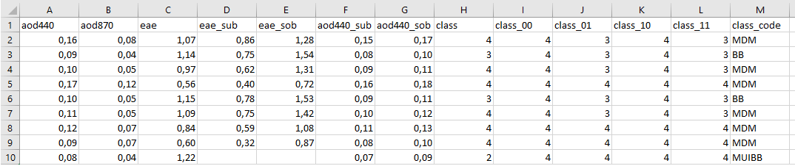
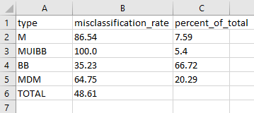
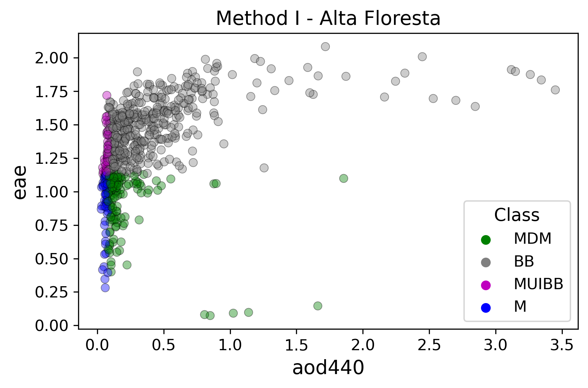
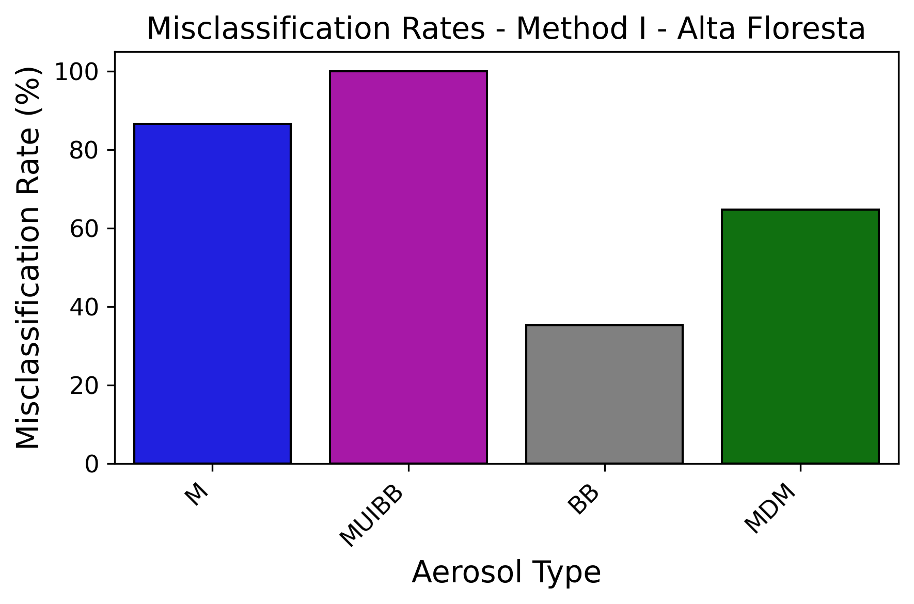

# AERCLASS Example Workflow

This folder provides a minimal working example demonstrating how to run
the full AERCLASS aerosol classification workflow.

The example includes:

-   an input dataset
-   a script that runs all classification methods
-   example visualizations of the outputs

The script `run_aerclass.py` executes the full analysis pipeline.

------------------------------------------------------------------------

# Example dataset

The dataset provided in this folder:

    data/alta_floresta_daily.xlsx

contains aerosol optical properties derived from AERONET observations at
the Alta Floresta site.

The file is used only as an example dataset to demonstrate how AERCLASS
processes input data.

------------------------------------------------------------------------

# Input data format

AERCLASS expects a tabular dataset containing aerosol optical
properties. Each row corresponds to one observation.

Typical variables used by the classification methods include:

  Variable   Description
  ---------- ------------------------------------
  aod440     Aerosol Optical Depth at 440 nm
  aod500     Aerosol Optical Depth at 500 nm
  eae        Ångström Exponent
  arod       Aerosol Optical Depth Ratio
  fmf500     Fine Mode Fraction
  ssa440     Single Scattering Albedo at 440 nm
  rri440     Real Refractive Index

Different classification methods require different combinations of these
variables.

Example structure of the input table:

------------------------------------------------------------------------

# Running the example

From the repository root directory install the package in development
mode:

    pip install -e .

Then run the example script:

    python examples/run_aerclass.py

The script will automatically:

-   load the input dataset
-   apply all aerosol classification methods implemented in AERCLASS
-   propagate measurement uncertainties
-   generate diagnostic plots
-   export classification tables

------------------------------------------------------------------------

# Outputs

For each classification method the script produces several outputs.

------------------------------------------------------------------------

## Classified dataset

Example file:

    method_I_classified_data.csv

This table contains:

-   the original aerosol properties
-   the assigned aerosol type
-   additional classification information

Example output:

------------------------------------------------------------------------

## Summary statistics

Example file:

    method_I_summary.csv

These tables summarize the relative frequency of each aerosol type
identified in the dataset.

Example summary table:

------------------------------------------------------------------------

## Diagnostic plots

Two types of figures are generated for each classification method.

### Distribution plot

Scatter plot showing the aerosol properties used by the classification
scheme and the corresponding aerosol-type regions.

Example:

------------------------------------------------------------------------

### Frequency bar plot

Bar chart showing the relative occurrence of each aerosol type.

Example:

------------------------------------------------------------------------

# Notes

The example dataset and parameters are intended for demonstration
purposes.

Users can adapt the script `run_aerclass.py` to analyze their own
datasets by modifying:

-   the input file
-   uncertainty parameters
-   filtering options
